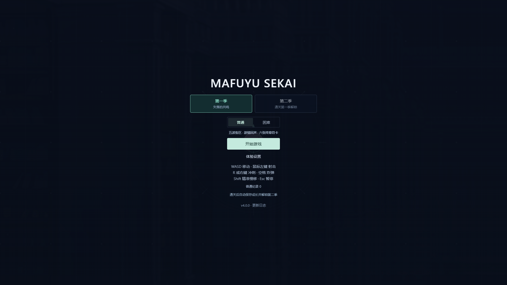

# Mafuyu Sekai · Neon Overdrive

**v4.0.0 · 镜界复奏**

面向 PC 键鼠的双季霓虹街机射击游戏。第一季五波之后挑战六张独立符卡；真实通关后，解锁第二季的两档难度并继承武器等级、经验和子机。第二季包含六段战斗、六种新敌人、两位守关首领与六符卡最终战。



## 运行与构建

需要 Node.js 22.13 或以上。

```sh
npm ci
npm run dev
```

打开终端显示的地址，默认 http://127.0.0.1:5173 。

```sh
npm run build
npm run preview
```

将完整 `dist/` 目录交给静态 HTTP 服务；`npm start` 同样是构建预览。相对 base 支持子目录，旧 `/dx.html` 保留查询参数并跳回首页。需要硬件加速及 WebGL。

Vercel 由根目录 `vercel.json` 固定使用 Vite、`npm ci --include=dev`、`npm run build` 和输出目录 `dist`。Root Directory 为仓库根目录。发布后核对相同提交的部署状态与线上浏览器流程。

## 操作

| 操作 | 按键 |
| --- | --- |
| 移动 / 瞄准 | WASD / 鼠标 |
| 连续射击 | 按住左键 |
| 精准慢移 | Shift，180 单位/秒，强化显示核心 |
| 冲刺 | R / 右键，移动方向优先，静止时朝准星 |
| 炸弹 | Space，按下触发一次 |
| 暂停 / 继续 | Esc，失焦自动暂停 |
| 强化选择 | 点击或 1 / 2 / 3 |

普通移速 300；敌弹、激光与范围攻击使用半径 7 的核心判定，撞怪/地雷/边界使用半径 18。两季炸弹均最多 5 枚，满额掉落每枚转为 30 XP。炸弹保留附近 750×750 伤害、全场清弹和 2 秒无敌。

冲刺冷却 2.6 秒，结束后 0.85 秒内下一发是瞬发贯穿炮：伤害 40、宽 88、长 2400，同时消除走廊中的敌弹，过热时也可发射。主炮 Lv1–10 成长和最多三台子机不变；停火恢复弹药与热量。

普通/困难开局固定。困难基础怪生命 ×1.5、移动 ×1.3、弹速 ×1.28、受击伤害 2，首领生命 ×1.35；判定大小不随难度变化。

## 两季战役

第一季保留五波各 40 秒与第三波 ECHO 门禁。MAFUYU 改为三阶段、六张独立血条：零响针雨、交错织幕、逆相花庭、镜面折光、无声刻印、空白终曲。大伤害不会越过一张卡，卡间清除该遭遇的弹幕和危险；不存在永久绿色安全扇区。

第二季「镜界复奏」依次为镜界入口、幕门街区、中继回廊、复奏断层、裂核庭院、终章前线，各 75 秒。第二/第四段后必须击败 PALISADE / REPRISE，第六段结算选卡后进入 LACUNA 最终战。两位小 Boss 仍有有限增援，击败各补 2 HP、1 炸弹、弹药和冷却。普通敌人全部使用镜盾卫、幕门织者、折返投手、轨迹采样者、中继修复者和裂核载体六种新机制。

第二季入口及六段结算，共七次三选一。18 个唯一模块分属主炮、子机、机动资源：穿透/翼炮/精密/碎晶/连锁/分光，追迹/集火/减速/分工/拦截/护刃，双冲刺/排热/弹匣/擦弹/复苏/寻物。选择暂停模拟，强化不因受伤丢失。Lv10 后每 600 XP 获得 +5% 共鸣伤害，最多四级，仅本局有效。

两季最终 Boss 固定 1600×900 战场，HUD 位于画布外；常规战斗为 4000×4000 世界、1600×900 固定逻辑视野。窗口均等比适配，低画质减少装饰与分辨率，保留危险预告。

## 浏览器存档

- 任意难度真实击破第一季六张符卡后，解锁第二季两档难度。旧最高分不代表通关，升级后需完成一次第一季。
- 保存同一次通关的完整等级/XP/子机快照；比较顺序为等级、子机、XP，不拼接不同通关的字段。
- 第二季以保存等级为掉级下限，开局满生命/弹药、清热、3 炸弹。失败或刷新后从第二季第一段重新开始，模块及共鸣清空。
- 第二季与无尽不回写第一季继承快照。无尽保留本局构筑及复苏等已消耗状态。
- `mafuyu-sekai:profile:v1` 是版本化战役档，带备份和跨标签同步；存储被拒绝时本页面仍能继续，并显示“未保存到浏览器”。不删除原设置和最高分。

## 架构

Vite + TypeScript + React + PixiJS 8 / WebGL，单一主循环使用 60Hz 固定模拟与渲染插值。React 只订阅 HUD/流程状态。

| 文件 | 职责 |
| --- | --- |
| `campaign.ts` | 分季流程、预约、守关目标、结算和季终 |
| `profile.ts` / `upgrades.ts` | 版本化存档、完整继承、18 模块与确定性候选 |
| `simulation.ts` / `projectile-motion.ts` | 战斗、模块、分段弹道、对象池和遭遇清理 |
| `season2-ai.ts` / `spellcards.ts` | 六种新敌人、部件、小 Boss、两季符卡 |
| `enemy-ai.ts` / `miniboss-ai.ts` | 第一季普通怪与 ECHO |
| `runtime.ts` / `input.ts` / `clock.ts` | 存档接线、唯一循环、输入和销毁 |
| `renderer.ts` / `effects.ts` | 共享图集、原大头、程序机体、危险与反馈 |
| `audio.ts` / `dialogue.ts` | Web Audio 缓存/混音、两季通讯 |
| `App.tsx` / `styles.css` | 简洁菜单、外置 HUD、设置、选择与结算 |

## 验证

```sh
npm run check
npx playwright install chromium
npm run test:e2e
npm run benchmark
node scripts/validate-danmaku.mjs
npm run test:soak
```

`check` 包含类型、lint、模拟测试、五张原始 PNG SHA-256 和生产构建。浏览器测试覆盖真实通关保存/刷新/第二季、七次选卡、四种窗口、暂停和重开。运行性能测试前先构建，避免同时运行其他浏览器或 CPU 压力任务。

`benchmark` 保留 180 敌人 + 70 地雷 + 1200 子弹 + 900 粒子的 30 秒场景。`validate-danmaku.mjs` 测最密集符卡及模块组合；`validate-encounters.mjs` 为同一脚本的兼容入口。`test:soak` 默认第二季、普通、真实 30 分钟无尽；`MAFUYU_SOAK_SEASON`、`MAFUYU_SOAK_DIFFICULTY`、`MAFUYU_SOAK_SECONDS` 可切换场景。无人值守无敌测试仅验证稳定性，不代表真人难度。

`node scripts/balance-v4.mjs` 复现两档难度、低/中/高继承和三种构筑偏好的 36 组模拟测量；正常生命与无敌输出样本分开记录。不同继承的最终战耗时仍有偏离目标的样本，详见验证记录。`node scripts/verify-deployment.mjs` 检查线上版本与真实完成事件驱动的保存/刷新/第二季入口，使用独立浏览器档；`MAFUYU_DEPLOYMENT_URL` 可指定部署地址。

`?debug=1` 开启性能和测试接口：`practice({season:'s2',cardIndex:2})`、`practice({season:'s2',mode:'endless',modules:[...]})`、`stress()`、`state()`、`snapshot()`。练习不会写入真实通关。正常页面不展示这些工具。

详见 [v4 设计](docs/design-v4.0.md) 与 [v4 验证](docs/validation/v4.0.0.md)。RTX 3060 Laptop 数据单列；核显 1080p 60 FPS 目标仍需对应设备实测。

## 原始资源与日志

角色、背景、子弹、血包五张原始 PNG 和路径不变；校验基准为 `docs/baseline/assets.sha256.json`。新增机体、节点、碎核、弹形和色调由程序生成。既有额外道具素材的许可见 [素材记录](docs/asset-sources-v3.1.md)，21 组原对话仍保留。

每次功能/平衡变更更新唯一日志来源 `public/data/changelog.json`，最新在前，包含版本、日期、标题和 1–5 条重点。当前 **v4.0.0（2026-09-12）**。浏览器版本不包含 Electron 或触屏操作。
