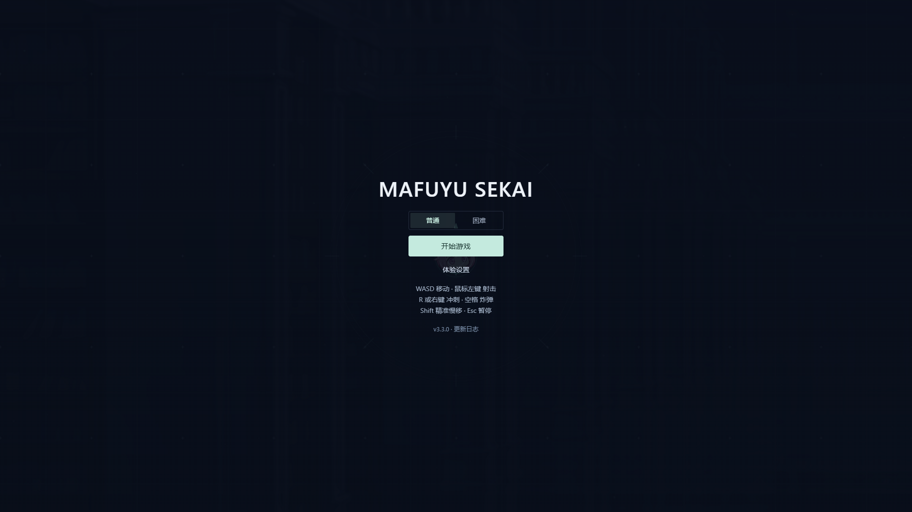

# Mafuyu Sekai · Neon Overdrive

**v3.3.0 · Mafuyu Sekai**

面向 PC 键鼠的霓虹街机射击游戏。五个 40 秒波次之后进入独立 Boss 战，通关可保留成长并继续无尽挑战。角色、背景、子弹、血包五张原始 PNG 及原有 21 组对话完整保留。



## 本地运行

需要 Node.js **22.13 或以上**（建议使用维护中的 LTS）。

```sh
npm ci
npm run dev
```

打开终端显示的本地地址，默认 `http://127.0.0.1:5173`。

```sh
npm run build
npm run preview
```

`npm start` 同样用于预览构建。发布时将整个 `dist/` 目录交给静态 HTTP 服务，不将 Vite preview 当作生产服务器。资源使用相对 base，支持托管于子目录。旧 `/dx.html` 自动跳转首页并保留查询参数。需要浏览器启用硬件加速和 WebGL；图形初始化失败会显示可重试的错误页。

Vercel 部署由根目录 `vercel.json` 固定为 **Vite**：安装 `npm ci --include=dev`，构建 `npm run build`，输出 `dist`。该文件覆盖旧项目保存的框架、安装／构建命令和输出目录；项目 Root Directory 应为仓库根目录。部署后检查对应提交的 Vercel 状态以及线上页面，本地构建成功不等于远端部署成功。

## 操作与战斗

| 操作 | 按键 |
| --- | --- |
| 移动 | WASD；斜向速度与直线一致 |
| 瞄准 / 连续射击 | 鼠标 / 按住左键 |
| 精准慢移 | 按住 Shift；移速 180，弹道散布减半，松开立即恢复 |
| 战术冲刺 | R 或右键；移动方向优先，静止时朝准星 |
| 清屏炸弹 | Space；清除全场敌弹，对附近 750×750 区域造成伤害 |
| 暂停 / 继续 | Esc；失焦或切换标签页也会自动暂停 |

- 冲刺冷却 2.6 秒，冷却结束前 0.14 秒内可提前短按；结束后 0.85 秒内的下一次射击变为瞬发贯穿炮：宽 88、长 2400、伤害 40，并清除同一走廊上的敌弹。消耗 1 弹药，过热时也可释放。
- 停火后快速恢复弹药、降低热量；过热时短暂锁定普通射击，移动不受影响。
- 拾取经验提升武器等级，逐步获得多发、特殊弹、追踪和穿透。受伤会损失经验并可能掉级。
- 第 2、3、4 波开始时在身边出现支援模块，靠近拾取可逐次获得最多三台环绕子机。子机使用主角原始大头，随攻击朝向旋转；每台自动攻击 560 范围内的敌人，每 0.6 秒造成 3 点伤害，不消耗主武器弹药或热量。受伤不丢失，通关后可带入无尽。
- 保留生命、炸弹、弹药、冷却液、微型爆破和黑洞吸附道具；靠近非经验道具会显示名称。尖齿外壳、红色核心和黄黑警戒圈表示地雷。Boss 入场清理敌人和敌弹，已掉落的奖励保留。
- 菜单选择普通或困难，开局后固定；重开与无尽保留难度，最高分分别记录。困难普通敌人生命 ×1.5、移速 ×1.3、敌弹速度 ×1.28、单次伤害 2 点，刷怪间隔 ×0.78；首领生命 ×1.35。
- 五波各 40 秒；每波结算提供 40/60/80/100/120 XP，补偿压缩流程后的成长。普通／困难强敌最多同时三／四只出招，起手至少相隔 0.28／0.18 秒。困难敌人会预测包抄、交错扫射与三角布雷。
- 第三波第 8 秒预告 ECHO 游猎回声，1.6 秒后入场，普通刷怪与波次计时继续。ECHO 使用锁向突进接远程激光，困难后半血追加第二段带预告的突进；击杀掉落经验、治疗、弹药、冷却液与子机模块。
- Boss 在 65%/30% 生命切换阶段，使用锁定扇射、带缺口的环弹、地面连爆与侧向扫射激光。普通／困难激光预告完整锁定 2.2／1.25 秒；紫色扇区表示将扫过的范围，箭头表示方向。困难追加交错环弹与侧翼爆破、五点连爆，并在出招前依据距离和移动选择招式。大招期间小怪暂停强攻击。
- 设置提供三档画质、主音量/音乐/音效、震屏强度和减弱动态。设置与最高分仅保存在本机浏览器，不上传数据。

## 实现结构

Vite + TypeScript + React + PixiJS 8（WebGL）。所有战斗都由独立的 **60Hz 固定步长模拟**推进，显示器刷新率仅影响渲染插值。React 只订阅 HUD 和流程状态，不保存逐帧实体。

| 模块 | 职责 |
| --- | --- |
| `src/game/config.ts` / `types.ts` | 集中数值、资源路径、模拟和界面契约 |
| `simulation.ts` / `math.ts` / `pool.ts` | 关卡、碰撞、奖励、空间网格与对象池 |
| `difficulty.ts` / `enemy-ai.ts` / `boss-ai.ts` / `miniboss-ai.ts` | 难度、敌人分工、两种首领、锁定攻击与共享预警参数 |
| `runtime.ts` / `clock.ts` / `input.ts` | 唯一主循环、输入、状态机、暂停/恢复与资源销毁 |
| `renderer.ts` / `effects.ts` | 原始精灵、批量图形、预警、粒子、浮字与分辨率预算 |
| `audio.ts` / `dialogue.ts` | 缓存混音、并发声部、模拟时钟驱动的角色通讯 |
| `App.tsx` / `styles.css` | 菜单、设置、HUD、结算和响应式布局 |

世界为 4000×4000，所有窗口共享 1600×900 的逻辑视野，16:9 等比居中。低/中/高画质最大像素预算分别为 1440×810、1920×1080、2400×1350。画质不影响敌人、子弹、碰撞、随机掉落和危险预告。

## 检查与性能测量

```sh
npm run check
npx playwright install chromium
npm run test:e2e
npm run benchmark
npm run test:soak
```

- `check`：类型、ESLint、模拟/输入/时钟测试、原始图片 SHA-256、生产构建。
- `test:e2e`：自动启动独立本地测试服务，检查实际浏览器输入、设置、重开、结算、多分辨率和错误恢复；报告位于 `playwright-report/`。
- `benchmark`：使用生产构建预览，预热 3 秒，再测量 30 秒持续压力。产出 `docs/validation/performance.json` 与截图。请先运行 `build`，关闭其他高负载测试后测量。
- `test:soak`：真实浏览器持续运行 30 分钟无尽，记录资源与回收后内存；产出 `docs/validation/soak.json`。测试使用无敌自动操控，仅验证稳定性，不作为真人平衡结论。
- `node scripts/validate-encounters.mjs`：生产构建下逐一验证 ECHO 两阶段、困难 Boss 组合、低画质预警与小窗口菜单，并保存带版本的画面和状态记录。`MAFUYU_SOAK_DIFFICULTY=hard` 可将无尽稳定性脚本切到困难；`MAFUYU_SOAK_SECONDS` 可缩短采样时长。
- 压力场景固定为 **180 非雷敌人 + 70 地雷 + 1200 子弹 + 900 动态粒子**。这是专用测试场景；正常玩法的敌人总上限仍是 180，地雷最多 70。
- `?debug=1` 显示性能面板并启用 `window.__MAFUYU_DEBUG__` 测试接口，包括 `stress()`、`scenario('boss')`、`scenario('arsenal')`（子机、道具、地雷试玩场景）、`scenario('enemy-tactics')`、`scenario('boss-laser')` / `'boss-nova'` / `'boss-bombard'`（定向检查预警）、`snapshot()`、`lifecycle()`。默认界面不展示开发工具。

稳定性验证区分 108,000 步模拟测试和真实浏览器运行，并标注对应版本。核显 1080p 60 FPS 是验收目标；当前实测设备为 RTX 3060 Laptop，不能代替核显验收。新版结果见 [v3.3.0 验证记录](docs/validation/v3.3.0.md)，历史结果见 [v3.2.0 验证记录](docs/validation/v3.2.0.md) 和 [v3.0.0 验收记录](docs/validation/README.md)。

## 原始素材与版本维护

`docs/baseline/assets.sha256.json` 保存 v2 的五张图片哈希；`npm run test:assets` 检测任何字节变化。光晕、弹幕轮廓与白闪纹理由代码在运行时生成。v3.1 新增八份小型道具／子机素材，来源、CC0 许可和哈希见 [素材记录](docs/asset-sources-v3.1.md)；玩法依据和调参见 [设计记录](docs/combat-design-v3.1.md)。v3.2 子机复用原始 player.png，未新增或修改贴图；敌人与首领设计见 [v3.2 设计](docs/design-v3.2.md) 和 [一手调研](docs/research-v3.2.md)。旧版截图和开局测量位于 `docs/baseline/`，可通过 `node scripts/capture-baseline.mjs` 从 Git 中的 v2 基线 `bd37056` 重新采集。

**每次功能、平衡或资源改动必须更新 `public/data/changelog.json`。** 它是唯一日志来源，Vite 将其提供给界面，静态地址也保留。最新版本放在数组开头，包含 `version`、`date`、`title`、1–5 条 `highlights`。发布前确认菜单版本号、完整日志弹窗和本次改动一致。

困难模式与 ECHO 的实际数值、组合设计和一手来源见 [v3.3 设计记录](docs/design-v3.3.md)。调试接口新增 `difficulty('hard')`（菜单中设置）和 `scenario('miniboss')` / `scenario('miniboss-arrival')`。

当前版本：**v3.3.0（2026-09-11）**。本轮仅构建浏览器版本，不包含 Electron 安装包或触屏操作。
