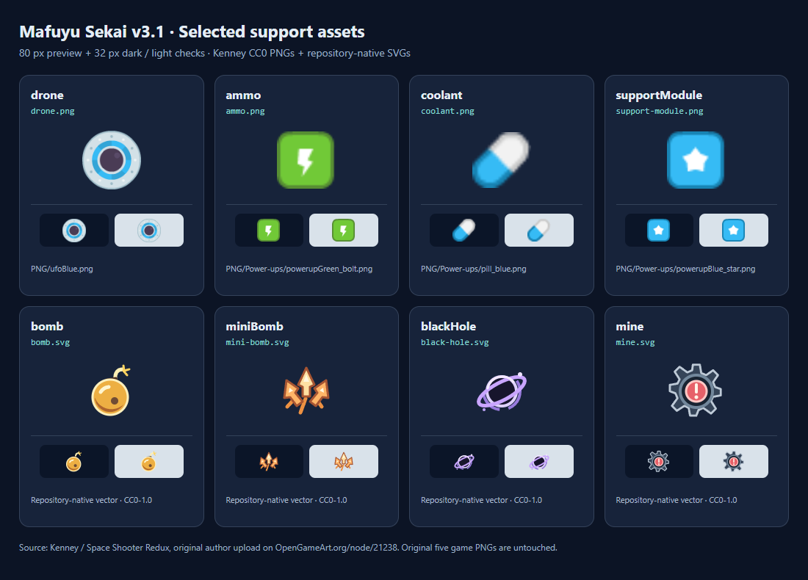

# v3.1 支援子机、道具与地雷素材来源

核实日期：2026-09-11（Asia/Shanghai）。本次只新增 `public/assets/support/` 内的素材，没有改变原有 `player.png`、`enemy.png`、`bullet.png`、`health.png`、`bg.png`。已运行 `node scripts/verify-assets.mjs`，五张原图的 SHA-256 全部匹配 v2 基线。

## 来源与许可

四张 PNG 来自 Kenney Vleugels 的 **Space Shooter Redux**。已核实 [原作者在 OpenGameArt 的发布页](https://opengameart.org/node/21238) 明确标注作者 Kenney 与 CC0，并查看了 [Kenney 作者资料](https://opengameart.org/users/kenney)。下载包内 `license.txt` 同样写明 CC0，允许个人和商业项目使用，署名可选；其原始字节随本次选择一并保存为 [LICENSE-Kenney.txt](../public/assets/support/LICENSE-Kenney.txt)。本项目仍保留 Kenney.nl 署名与来源信息。

- 原始下载：[SpaceShooterRedux.zip](https://opengameart.org/sites/default/files/SpaceShooterRedux.zip)，1,108,776 字节。
- 原始 ZIP SHA-256：`d44a371a8fa1eb5d61a4fed3677954590aa015a78d2afb5f97924cfe02e3f700`。
- 许可：[CC0 1.0 Universal](https://creativecommons.org/publicdomain/zero/1.0/)。
- 本次没有将完整资源包、字体、音频或 SWF 放入 `public/`，也没有执行包内内容。
- 四张 PNG 按原始字节复制，只更换目标文件名，没有裁剪、缩放、着色或重新编码。

炸弹、追踪爆发、黑洞与地雷没有从该包中找到足够直观的形状，因此新增四份本仓库原生 SVG 源码。它们没有嵌入外部图片、字体或标志，也未使用 AI 图片生成工具。仅这四份 SVG 的 CC0 声明见 [LICENSE-project-icons.txt](../public/assets/support/LICENSE-project-icons.txt)，不改变仓库其他内容的许可。

## 运行时映射

路径均相对于部署的 `BASE_URL`；建议在现有资源加载器中使用 `import.meta.env.BASE_URL + path`，不要写死域名。SVG 可像 PNG 一样通过 `HTMLImageElement.decode()` 解码后交给 PixiJS。

| 功能键 | 运行时路径 | 原尺寸 | 来源 | 辨识特征与使用建议 |
| --- | --- | --- | --- | --- |
| `drone` | `assets/support/drone.png` | 91×91 | `PNG/ufoBlue.png` | 蓝白圆形飞行器；建议显示为 32–38 px 子机，保持贴图本色 |
| `ammo` | `assets/support/ammo.png` | 34×33 | `PNG/Power-ups/powerupGreen_bolt.png` | 绿色闪电方形能量补给；建议显示为 34–40 px |
| `coolant` | `assets/support/coolant.png` | 22×21 | `PNG/Power-ups/pill_blue.png` | 蓝白胶囊，与现有血包贴图区分；建议显示为 32–36 px |
| `supportModule` | `assets/support/support-module.png` | 34×33 | `PNG/Power-ups/powerupBlue_star.png` | 蓝色星形模块方块；建议显示为 36–42 px，拾取反馈可以出现子机图像 |
| `bomb` | `assets/support/bomb.svg` | 80×80 | 仓库原生 SVG | 金色圆炸弹与导火线；建议显示为 36–42 px |
| `miniBomb` | `assets/support/mini-bomb.svg` | 80×80 | 仓库原生 SVG | 三枚橙色分散箭头，表达追踪弹爆发；建议显示为 36–42 px |
| `blackHole` | `assets/support/black-hole.svg` | 80×80 | 仓库原生 SVG | 紫色斜向吸积环与暗中心；建议显示为 40–46 px |
| `mine` | `assets/support/mine.svg` | 80×80 | 仓库原生 SVG | 灰色八齿外壳与红色感叹号；尺寸跟随碰撞半径，保持敌方危险语义 |

八份运行时素材合计 **7,586 字节**。`manifest.json` 和许可文件供审计使用；联系表位于 `docs/validation/v3.1-support-contact-sheet.png`，不会随 `public/` 打包。原血包与经验球继续使用项目原有素材，本次映射不替换它们。

## 文件完整性

机器可读的来源、尺寸、原压缩包路径和 SHA-256 见 [manifest.json](../public/assets/support/manifest.json)。PNG 的目标文件哈希也就是对应原 ZIP 条目的源文件哈希。

| 文件 | SHA-256 |
| --- | --- |
| `drone.png` | `460c90365b97ecb1c7fcd6cbbf56546f8397544761cc348f3baf97f5097dc89c` |
| `ammo.png` | `e3712e9da8b86d5a7958554f1d68363306dc3a9b4f638e0b1c06792ac545eb59` |
| `coolant.png` | `b213398641855826799cd030a4b4e6f72fe3524537dd8adddaf750a7ca98f39a` |
| `support-module.png` | `c2be916c7391b79a46382b02937a351de8a310ede5c6b18b1a12b625933a685c` |
| `bomb.svg` | `300537d4140d3ea46e0a4296bbdbc9f631cc20afd509f8529a730107fd7b624f` |
| `mini-bomb.svg` | `55931f9dfcb1b24753eec5e5b957fb93219089fd988974b719891e3c452154b9` |
| `black-hole.svg` | `053a1411d6068d1cfaf556b4b3b3d31f89713768208766087f0e3eb6fb2e9b22` |
| `mine.svg` | `ed6f3a6faf13819d723da24e279f91ace3aa0003108f15edc892ababeafe6d9b` |

## 视觉核对

已在 Chromium 中解码全部八份素材，并以透明背景叠加深色、浅色底检查。联系表包含放大预览与 32 px 检查，确认子机、方形补给、胶囊、圆炸弹、三箭爆发、黑洞和齿状地雷有不同轮廓。战斗中仍需要保留现有拾取反馈和危险预警，不应仅靠颜色传达效果。

