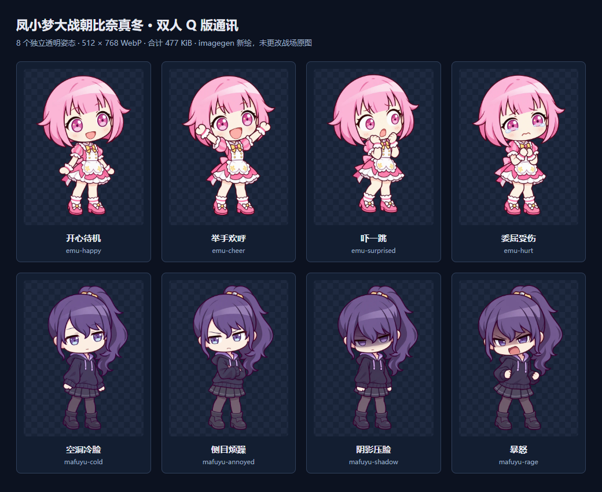

# v5.1 双人小人素材

日期：2026-09-17。用户选择「重新做完整 Q 版」，由内置 imagegen 为本项目新绘八张独立姿态。没有引入官方 SD 数据包、第三方 Live2D 文件或新的音频。

## 调研与采用路线

- [Sekai Viewer Chibi](https://sekai.best/chibi) 及其 [实现源码](https://github.com/Sekai-World/sekai-viewer/blob/dev/src/utils/ChibiPlayer/ChibiPlayer.ts) 可展示完整 SD 动画，但导出功能不等于本项目的再分发许可。
- [sooso 笑梦像素 Live2D](https://sooso.booth.pm/items/4596182) 有免费配布和使用条件，未找到配套真冬；[DOG THEATER 全角色像素人物](https://724.booth.pm/items/3919282) 限定 pictSQUARE 用途。本轮没有复制其文件。
- 人物参考 [笑梦官方角色页](https://pjsekai.sega.jp/character/unite04/emu/index.html)、[真冬官方角色页](https://pjsekai.sega.jp/character/unite05/mafuyu/index.html) 以及仓库已有两张头像。新图是本作二创演绎，不是官方美术或官方授权声明。角色本身的权利属于原权利人。

## 最终素材

| 文件 | 表现 |
| --- | --- |
| emu-happy.webp | 开心待机 |
| emu-cheer.webp | 举手欢呼 |
| emu-surprised.webp | 受惊 |
| emu-hurt.webp | 委屈受伤 |
| mafuyu-cold.webp | 空洞冷脸 |
| mafuyu-annoyed.webp | 侧目烦躁、抱臂 |
| mafuyu-shadow.webp | 阴影压脸 |
| mafuyu-rage.webp | 握拳暴怒 |

生成顺序为笑梦基础形象、真冬基础形象，再以各自基础形象逐张产生三个姿态变体。粉白舞台服与深色卫衣保持统一，约两头身，画面中央全身构图。生成时要求真实透明通道、无文字／气泡／环境；源图 RGBA 校验通过，透明像素占约 51–55%。初始笑梦曾额外执行一次透明背景修订，以最终产物为准。

原始生成图 1024×1536，经等比尺寸优化及 WebP 格式编码为 512×768，保留 alpha；没有用代码重画人物或修改表情。运行时八图共 **488,016 字节（约 477 KiB）**，解码像素约 12 MiB；不需要新的骨骼动画引擎。

完整最终提示词、参考关系、生成源文件名及哈希、发布文件 SHA-256 均在 [manifest.json](../public/assets/comms/manifest.json)。源 PNG 保留在本机 imagegen 输出目录；游戏仅引用仓库内的新 WebP，不依赖本机目录或外部图床。`npm run test:assets` 同时检查五张原图、八份既有道具和八张通讯素材，通讯总量限制 2 MB。

以下联系图通过浏览器把真实透明图叠到棋盘底检查，没有把棋盘或背景写入角色素材：

