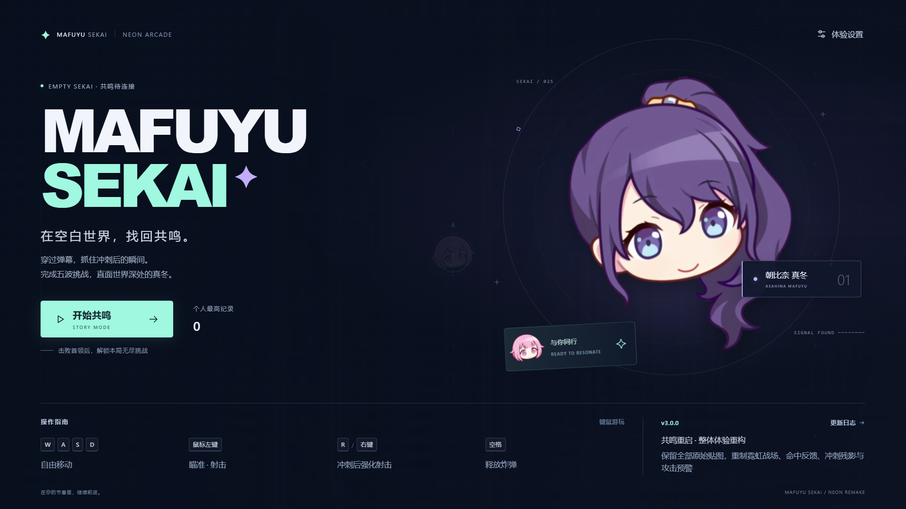
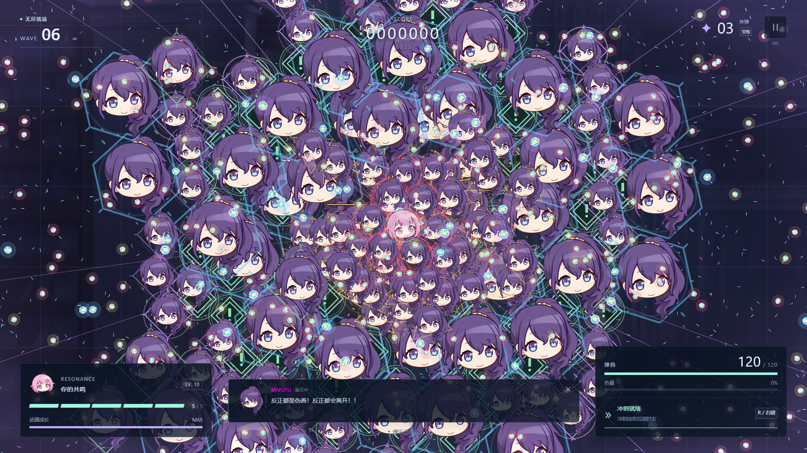

# v3.0.0 验收记录

这是 v3.0.0 的历史结果。最新子机与贯穿炮更新另见 [v3.1.0 验证记录](v3.1.0.md)，不将旧版本测量当作新版结果。

日期：2026-09-11（北京时间）。本记录区分已执行的自动化检查、独显测量以及仍需实机/真人确认的目标。

## 已通过的检查

| 检查 | 结果 |
| --- | --- |
| TypeScript 严格类型、ESLint、生产构建 | `npm run check` 通过 |
| 模拟、输入与时钟 | 46 项通过，包含 108,000 步 / 30 分钟模拟 |
| 浏览器流程 | 12 项 Playwright 检查通过 |
| 原始图片 | 5/5 SHA-256 与 v2 一致，路径未变 |
| 入口 | 单一 Vite 静态入口，`dx.html` 跳转并保留 query/hash |
| 版本记录 | 唯一 changelog 数据源，菜单与完整日志均为 v3.0.0 |

模拟测试覆盖 30/60/120/144 Hz 下完全相同的移动、射击次数、冷却、波次和 tick；斜向速度、首发响应、静止冲刺、锁定方向、长按炸弹、暂停清空输入、弹药与热量节奏；扫掠碰撞、穿透单目标去重、全图扫射弹回收、共享激光几何；七种掉落价值守恒、成长溢出、Boss 锁向/弹幕间隙、通关继续无尽、Boss 预警中死亡后连续重开 20 次。另有同帧玩家/Boss 死亡及终态保护的回归测试。

浏览器检查覆盖加载与正常开局、首发和瞄准、静止冲刺、按键边沿、失焦冻结和恢复、20 次重开仅一个 Canvas/一个模拟推进、失败与通关流程、Esc 暂停、设置持久化及键盘对话框、1280×720 / 1920×1080 / 2560×1440 / 2560×1080 的 16:9 布局，以及图片加载失败和 WebGL 丢失后的重试。错误恢复测试主动触发的 `Game stopped safely` 日志属于预期结果。

## 独显压力测量

原始数据：[performance-v3.0.0.json](performance-v3.0.0.json)。生产构建，Windows，i7-12700H，RTX 3060 Laptop，Chromium 153，D3D11 硬件渲染，1920×1080 / DPR 1 / 中画质。使用完整 Chromium 的无头模式，避免 headless-shell 默认 SwiftShader 软件渲染污染结果。

固定负载为 **180 个非雷敌人、70 个地雷、1200 颗子弹、900 个运动装饰粒子**，预热 3 秒后连续采集 30 秒，共 5400 个帧间隔。

| 指标 | 本次测量 |
| --- | ---: |
| 平均帧率 | 179.97 FPS |
| P50 帧间隔 | 5.6 ms |
| P95 帧间隔 | 5.7 ms |
| P99 帧间隔 | 5.7 ms |
| 最大帧间隔 | 11.1 ms |
| 浏览器未捕获异常 | 0 |
| 持续实体/粒子数 | 250 / 1200 / 900 |
| 纹理计数 | 首次浮字分配 10 → 11，此后稳定 |

帧间隔来自浏览器 requestAnimationFrame 时间戳，是本机浏览器调度与负载的综合结果，不是显示器实测响应延迟。GPU 名称、启动参数及逐秒资源数均写入报告。核显 P95 ≤18ms、P99 ≤25ms 的目标尚待对应设备实测；独显达标不能推导核显达标。旧版基线是 720p 开局且使用 SwiftShader，不能与这里计算速度提升倍数。




## 长时间运行与试玩边界

30 分钟真实浏览器无尽已完成并通过，见 [soak-v3.0.0.json](soak-v3.0.0.json)：墙钟 1800 秒、模拟 1800 秒、61 次资源采样，无异常或阈值违规，结束后重开与返回菜单正常。这是启动于 v3.0.0 的独立浏览器运行，不包含 v3.1 的子机与贯穿炮。它与快速模拟测试分开记录，以实际墙钟时间推进游戏，检查状态、循环、实体、纹理和回收后内存。

诊断过程中，尚未主动清理的音效结束回调使原始监听器计数暂时从 204 升至 388，GC 后降至 208。原始证据保存在 `soak-listener-diagnostic.json`。已让结束/停止的音效主动清除回调；检查仍保留原阈值，并在超限时先额外回收、记录前后数据再判定，避免把可回收节点误判为持续增长。

本轮自动化验证游戏规则、稳定性与实际渲染。6–10 分钟通关、普通怪反馈和 Boss 不依赖固定连招的可玩性仍需真实玩家试玩确认。自动无敌操控可用于检查成长和关卡连通，但不代表普通玩家成功率。移动端、Electron 包、核显设备验收不在本机完成范围内。

## 重现

```sh
npm ci
npm run check
npx playwright install chromium
npm run test:e2e
npm run benchmark
npm run test:soak
```

压力脚本与长时间运行脚本各自启动生产预览，分别使用本机端口 5182、5183，结束后清理测试浏览器与服务。请顺序运行，以免同时占用 GPU 影响独立帧时间测量。Playwright 的测试输出在 `test-results/` 和 `playwright-report/`，这些临时目录不纳入版本控制。
