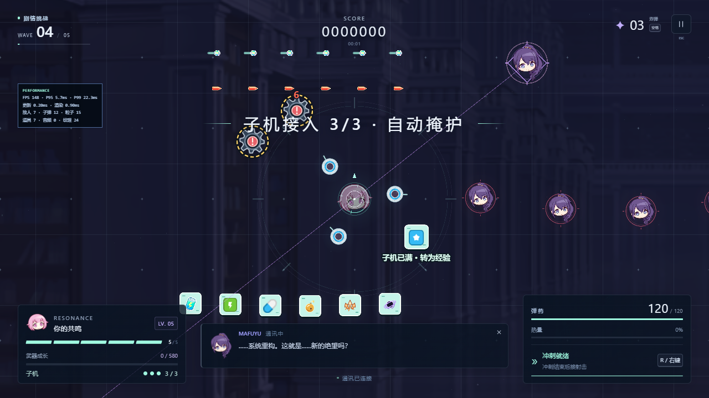
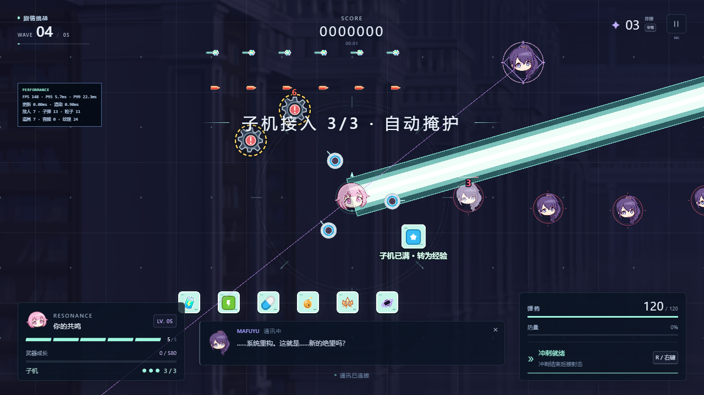
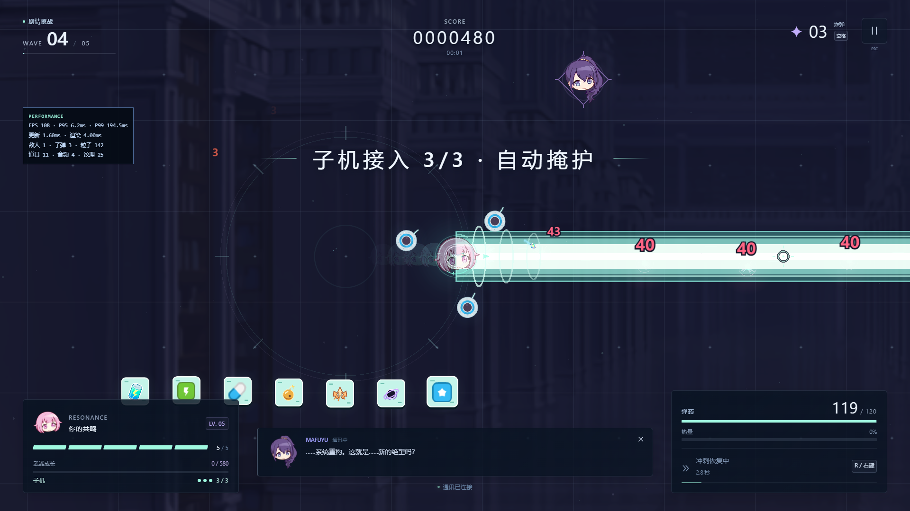

# v3.1.0 子机与贯穿炮验证

日期：2026-09-11（北京时间）。针对敌弹辨识、地雷与道具区分、后期支援和冲刺攻击的更新。设计及数值见 [设计记录](../combat-design-v3.1.md)，新增素材来源见 [素材记录](../asset-sources-v3.1.md)。

## 自动化结果

| 检查 | 结果 |
| --- | --- |
| TypeScript、ESLint、生产构建 | 通过 |
| 模拟、输入、时钟单元测试 | 58 / 58 通过 |
| Playwright 浏览器流程 | 13 / 13 通过 |
| 原五张 PNG | 5 / 5 SHA-256 与旧版一致，路径不变 |
| 新增素材 | 8 / 8 SHA-256 与来源清单一致，附许可文本 |

新增回归覆盖：2/3/4 波保证支援且每波一次；最多三台、超额转 XP；受伤掉级后保留、继续无尽保留、重开清空；空弹／过热／停火不影响子机；逐次拾取模块和目标离场再进入仍保持错峰；30/60/120/144 Hz 下子机轨道、射击次数、光束、伤害和资源相同。光束包含即时远距伤害、每个目标仅结算一次、180 目标上限、定向清敌弹、过热释放、缺弹边界及终态保护。

浏览器新增真实鼠标与 R 键流程：三台子机在过热时自动射击，冲刺结束后释放 2400×88 光束；暂停冻结模拟；重开后子机和光束均清空。原有失焦、20 次重开、通关继续无尽、四种窗口、设置、资源加载失败与 WebGL 恢复检查继续通过。

## 视觉检查

检查了 720p 的敌我弹幕、地雷、七类非经验补给、三子机，以及 1080p 的实际 R → 射击贯穿效果；另检查低画质与减弱动态时光束和危险提示仍存在。截图中的补给排布是专用测试场景，不是正常掉落密度；截图左侧即时性能数字包含初始化与测试调度，不作为性能测量结果。

## 独显压力测量

生产构建、1920×1080／中画质、Chromium 153／D3D11／RTX 3060 Laptop。预热 3 秒后连续测量 30 秒，固定 180 个非雷敌人 + 70 个地雷 + 1200 颗子弹 + 900 个装饰粒子；全部逐秒资源采样维持该负载。

| 指标 | 结果 |
| --- | ---: |
| 帧间隔样本 | 5400 |
| 平均 FPS | 179.97 |
| P95 / P99 | 5.7 / 5.7 ms |
| 最大帧间隔 | 11.1 ms |
| 纹理计数 | 19 → 20（首次浮字），随后稳定 |
| 浏览器未捕获异常 | 0 |

原始报告：[performance-v3.1.0.json](performance-v3.1.0.json)。这个固定压力场景没有额外子机；子机与光束的实际循环在下述无尽测试单独验证。帧间隔来自浏览器调度，不是显示器输入延迟。

## 长时间运行边界

完整 108,000 步、30 分钟模拟携带三台子机通过：全过程坐标有限，子机数量保持三台，光束数量不超过一条；确认实际产生子机射击及贯穿炮，敌人、弹幕与掉落上限正常。

新版生产构建完成 **120 秒真实浏览器无尽运行**，见 [soak-v3.1.0-120s.json](soak-v3.1.0-120s.json)：模拟推进 120.02 秒，5 次资源采样；三台子机始终存在，观察到 37 次贯穿炮；无浏览器错误或阈值超限。结束后重开，子机和光束清零；返回菜单后没有活动主循环。回收后堆内存从 6.76 MiB 增至 10.23 MiB，纹理计数从 22 增至 31，包含战斗浮字资源逐渐分配；短时结果不证明长时间完全无增长。

此前真实浏览器 30 分钟运行已经通过，但加载的是 v3.0.0，见 [历史报告](soak-v3.0.0.json)，不能证明新增子机和贯穿炮的长期资源稳定性。新版尚未重复完整 30 分钟浏览器运行；`npm run test:soak` 默认执行该检查，`MAFUYU_SOAK_SECONDS=120` 用于本次短时检查。

第四、五波的支援强度和 Boss 手感仍以真人试玩为准；自动化无敌操控只验证机制与稳定性。本机 RTX 3060 Laptop 测量不代替核显 1080p 验收。
