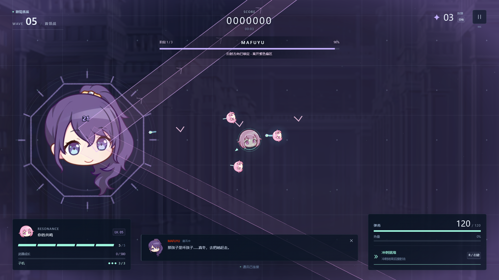
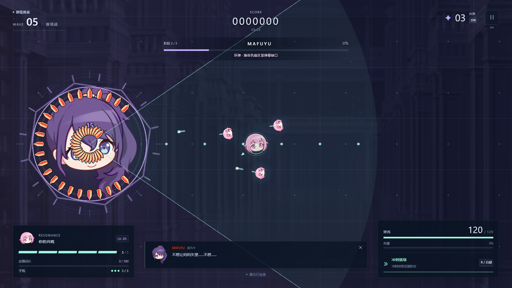
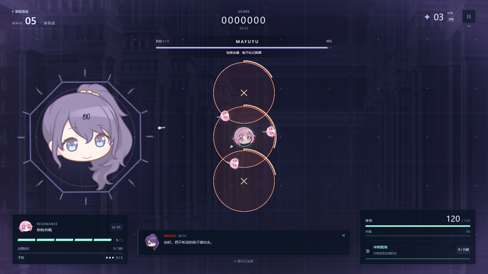
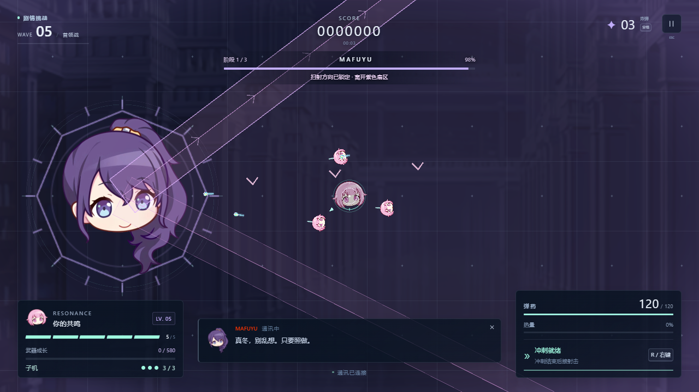

# v3.2.0 战术敌人与三阶段 Boss 验证

日期：2026-09-11（北京时间）。实现与取舍见 [设计记录](../design-v3.2.md)，来源见 [调研记录](../research-v3.2.md)。

## 自动化检查

| 检查 | 结果 |
| --- | --- |
| TypeScript、ESLint、生产构建 | 通过 |
| 模拟、AI、输入、时钟测试 | 130 / 130 通过 |
| Playwright 浏览器流程 | 16 / 16 通过 |
| 原始五张 PNG | SHA-256 与 v2 基线一致，路径不变 |
| 既有八份补充素材 | 哈希及许可检查通过；本版没有新增素材 |

覆盖 30/60/120/144Hz 一致性、40 秒波次、经验溢出、Shift 精准移动与松开响应、短按冲刺缓冲、按键长按和失焦清理。AI 用例覆盖有限预测、固定锁向、连射上限、布雷准备期、攻击名额和 Boss 抢占。

23 项实际模拟公平性用例中，玩家没有无敌、不用冲刺或炸弹：中距离及四个世界角落，延迟 0.3 秒再走位，激光开始后站定仍可躲过；墙边重叠的三个爆破标记在延迟 0.35 秒后可沿墙离开。站桩对照会掉血，排除了攻击没有生效的假通过。这些用例不证明任意存量地雷、小怪和弹幕组合都有无伤路线。

保留死亡优先的终态保护、Boss 预告中死亡重开、20 次连续重开、通关继续无尽、资源失败重试和 WebGL 恢复。浏览器新增真实 Shift、激光暂停不消耗预告、移动不改变已锁定角度、转阶段清理地面危险等流程。

## 生产画面

检查 1280×720、1920×1080、2560×1440、2560×1080 的页面布局，另检查 807×519 简洁菜单。生产构建验证子机头像转向、三阶段环弹缺口、爆破落点、激光预告与活动光束；低画质及减弱动态保留完整危险提示。最后修正了突进预告的圆形端帽，使其覆盖敌人圆形身体扫过的完整胶囊区域。

截图来自定向调试场景，主动选择 Boss 技能/阶段并提供子机；不代表自然开局或真人通关。记录见 [visual-v3.2.0.json](visual-v3.2.0.json)，未捕获浏览器异常为 0。

## RTX 3060 Laptop 压力结果

生产构建，1080p 中画质，Chromium 153 / D3D11。预热 3 秒后持续测量 30 秒；固定 180 个非雷敌人、70 个地雷、1200 颗子弹和 900 个动态装饰粒子。

| 指标 | 结果 |
| --- | ---: |
| 帧间隔样本 | 5398 |
| 平均 FPS | 179.93 |
| P95 / P99 | 5.7 / 5.7 ms |
| 最大帧间隔 | 11.2 ms |
| 纹理计数 | 19 → 20，之后稳定 |
| 浏览器异常 | 0 |

逐秒负载保持完整，原始数据见 [performance-v3.2.0.json](performance-v3.2.0.json)。此场景用于固定渲染压力比较，不包含 Boss 新技能或额外子机；它们由流程、视觉与模拟测试另行覆盖。测量是浏览器帧间隔，不是输入延迟。本机独显结果不能代替核显 1080p 验收。

## 持续运行

完整 **30 分钟模拟 / 108,000 步**通过。自动驾驶遇 Boss 后用实际移动输入接近并绕行，确认真正触发地面危险；三台子机全程存在，贯穿炮实际释放，所有位置与危险计时有限，子弹/敌人/危险数量受限。

生产构建还完成 **120 秒真实浏览器无尽运行**，见 [soak-v3.2.0-120s.json](soak-v3.2.0-120s.json)：模拟推进 120.0 秒，五次资源采样，三台子机与 37 次贯穿炮；无浏览器错误或资源阈值超限。结束后重开清空子机、光束和危险，返回菜单停止主循环。

回收后堆内存 7.56 → 10.70 MiB，纹理计数 22 → 39，包括逐渐分配的伤害浮字资源。三个采样点的原始监听器计数越过阈值后，按脚本固定规则回收再检查，均回到阈值内；原始与回收后记录都保留。此短跑只到无尽第 9 波，未到第 10 波 Boss，不作为新 Boss 的真实浏览器长期运行证据。

本版尚未重跑完整 30 分钟真实浏览器测试；`npm run test:soak` 可执行，历史 v3.0.0 的完整浏览器长跑不替代新版验证。自动驾驶使用无敌，仅验证稳定性；第四、五波及完整 Boss 难度仍需真人试玩。
