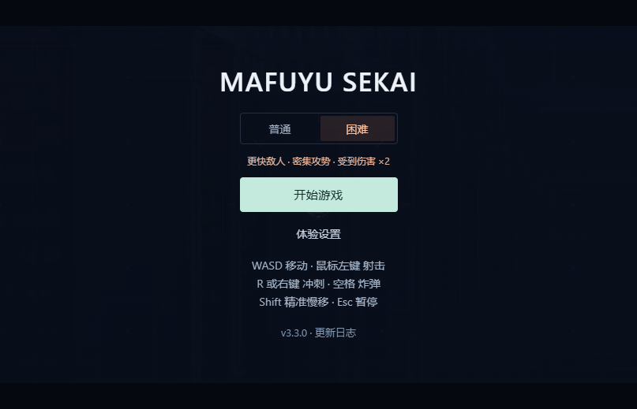
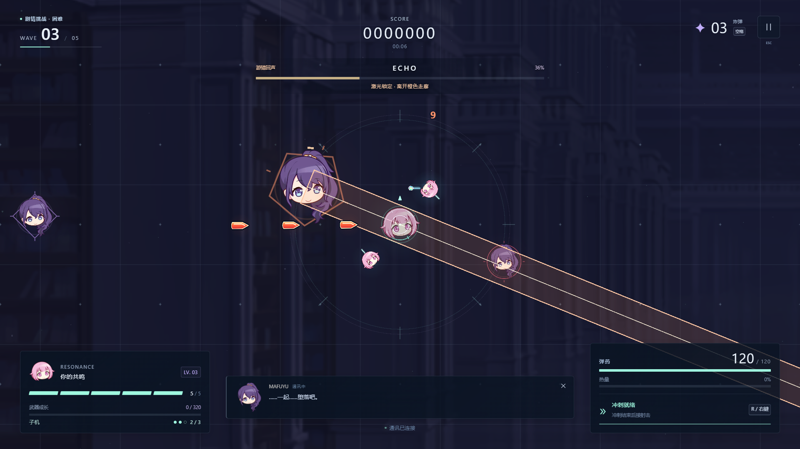
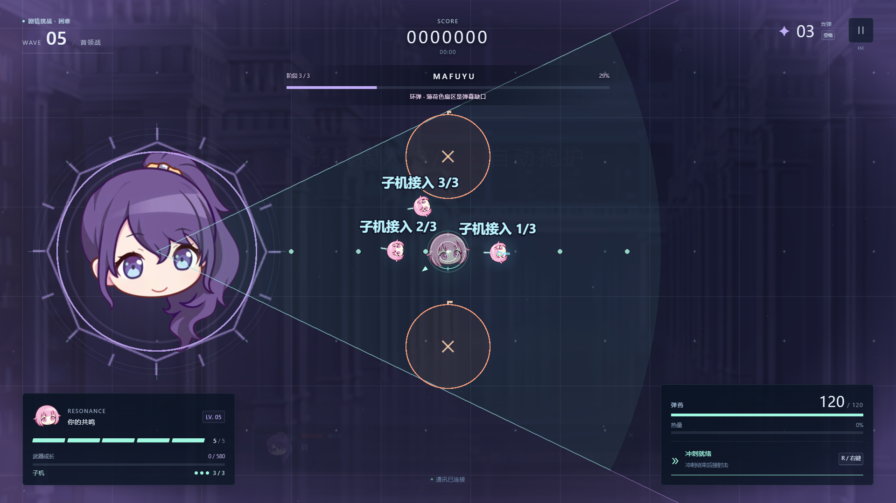

# v3.3.0 困难模式与 ECHO 验证

日期：2026-09-11。数值、攻击流程和一手研究见 [设计记录](../design-v3.3.md)。

## 自动化结果

| 检查 | 结果 |
| --- | --- |
| TypeScript、ESLint、生产构建 | 通过 |
| 模拟、AI、输入、时钟测试 | 218 / 218 通过，8 个文件 |
| 浏览器流程 | 19 项均通过；初跑 18 通过，修正新测试对血条控件的角色断言后，相关用例重跑通过 |
| 原始五张 PNG | SHA-256 与 v2 基线一致，路径不变 |
| 既有八份补充素材 | 哈希及许可检查通过，本轮未修改素材 |

新增检查覆盖难度保存与局内固定、两档最高分、生命/移动/弹速/实际伤害倍率、30/60/120/144Hz 等价推进、第三波第 8 秒预约、ECHO 与刷怪共存、满额重试、死亡奖励、重开/无尽难度保持。修正了 8 秒浮点边界迟一帧预约的问题；保留严格 480 tick 回归。

困难 Boss 检查锁定预告、站桩受伤对照、普通移动和冲刺逃离指定扫射场景、侧翼爆破与环弹缺口、交错发射、技能间隙及完整 80 秒时钟推进。ECHO 检查各段独立锁向、两段突进、边缘站位、扫掠接触、激光几何、阶段转换和 12 秒实际时钟推进。具体步行路线和反应时间边界见设计记录；这些用例不证明任意敌人组合都能无伤。

继续覆盖按键长按、失焦恢复、Shift 慢移、冲刺缓冲、穿透仅结算一次、预告中死亡重开、连续重开 20 次、通关后无尽、图片错误与 WebGL 失效恢复。

## 生产构建画面与遭遇战

`node scripts/validate-encounters.mjs` 实际运行困难 ECHO 两阶段，分别观察到 28 / 43 次状态变化，结束时同时存在 47 / 59 只普通敌人。二阶段第一轮激光前确实有两次带预告突进，恢复阶段发生、波次时钟继续、没有开启最终 Boss 阶段。困难最终 Boss 的环弹侧翼两个标记与地面五点标记数量准确，短激光使用 1.25 秒配置。浏览器异常为 0。

该脚本用调试接口预约 ECHO、指定 Boss 下一招和阶段，并提供无敌与子机。之后由游戏原本时钟推进，没有额外模拟步；它验证实际接线、表现和组合运行，不代表真人通关。

检查 1280×720、1920×1080、2560×1440、2560×1080 布局，另检查 807×519 困难菜单。低画质和减弱动态仍显示 ECHO 完整危险走廊。原始状态见 [visual-v3.3.0.json](visual-v3.3.0.json)。

## RTX 3060 Laptop 固定压力

生产构建 / Chromium 153 / D3D11 / 1920×1080 / 中画质，3 秒预热后采样 30 秒。固定 180 非雷敌人 + 70 地雷 + 1200 子弹 + 900 动态装饰粒子，全程负载保持。

| 指标 | 实测 |
| --- | ---: |
| 帧间隔样本 | 5400 |
| 平均 FPS | 179.97 |
| P95 / P99 | 5.7 / 5.7 ms |
| 最大帧间隔 | 11.1 ms |
| 浏览器异常 | 0 |

原始逐秒资源见 [performance-v3.3.0.json](performance-v3.3.0.json)。固定场景使用普通难度作版本间比较；困难与首领由独立遭遇战检查覆盖。测量的是独显浏览器帧间隔，不能替代核显验收或输入延迟测量。

## 稳定性范围

本轮 218 项中包含原有 30 分钟 / 108,000 步普通无尽模拟。困难模式的真实浏览器短跑单独记录；完整 30 分钟真实浏览器长跑尚未在本版重跑，历史版本结果不作为本版结果。

困难 **120 秒真实浏览器无尽**通过，见 [soak-v3.3.0-hard-120s.json](soak-v3.3.0-hard-120s.json)：墙钟 120.04 秒，模拟推进 120.02 秒，五次资源采样、三台子机、37 次贯穿炮、184 次击杀。浏览器/控制台错误与资源阈值违规均为 0；重开清空子机、光束和地面危险，菜单主循环停止。

起止强制回收后的堆内存为 7.14 → 11.67 MiB，纹理计数 22 → 49，监听器 206 → 208。中间未回收的堆内存最高采样 33.32 MiB，所有原始记录保留。短跑仅推进无尽第 6–9 波，未包含第 10 波最终 Boss，也不会触发剧情第三波 ECHO；两种首领由上面的独立遭遇战与模拟用例覆盖。无敌自动驾驶验证稳定性，整体难度仍需真人试玩反馈。
