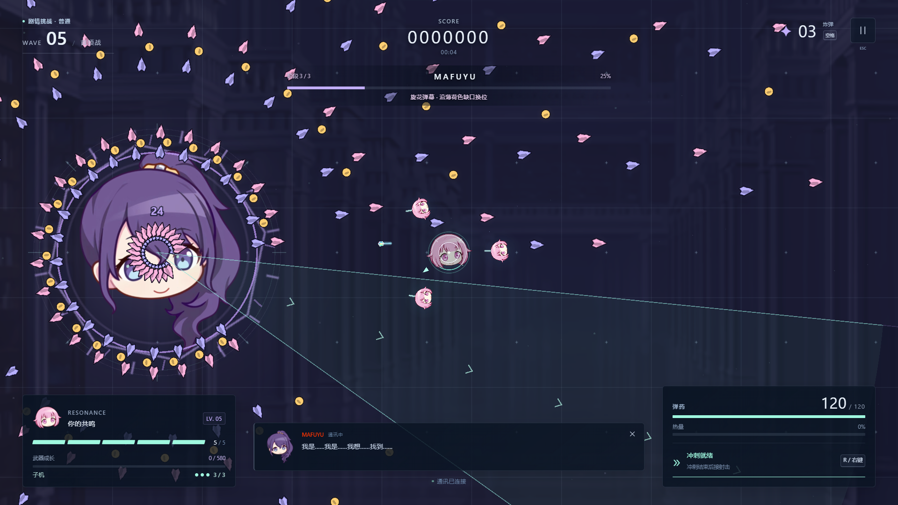
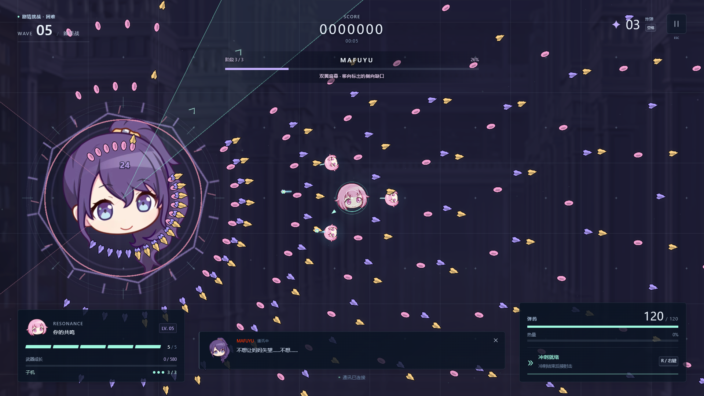
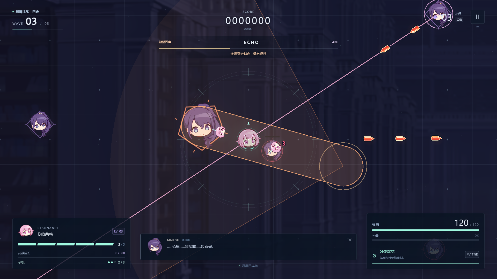
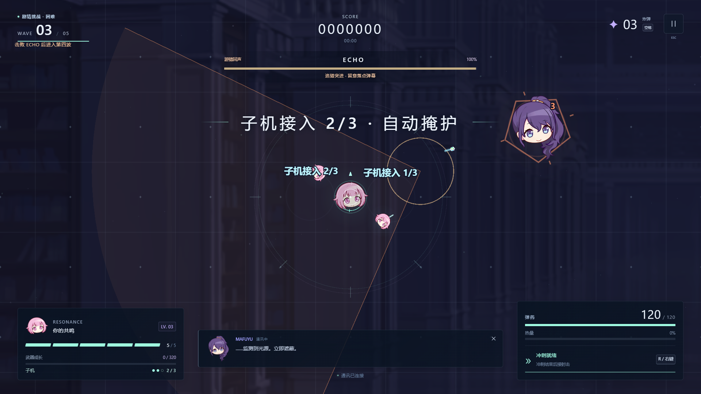

# v3.4.0 双首领与持续弹幕验证

日期：2026-09-11。数值、判定推导与东方 / BulletML 一手参考见 [设计记录](../design-v3.4.md)。

## 自动化结果

| 检查 | 结果 |
| --- | --- |
| TypeScript、ESLint、生产构建 | 通过 |
| 模拟、AI、输入、时钟测试 | 279 / 279，通过 10 个测试文件 |
| 浏览器流程 | 23 项均通过；首次 22 通过，更新旧技能名“地面连爆”的 UI 断言为“连爆星环”后，相关用例重跑通过 |
| 原始五张 PNG | SHA-256 与 v2 基线一致，路径不变 |
| 既有八份补充素材 | 哈希和许可检查通过；本轮轮廓由程序生成，没有修改素材 |

新增回归覆盖第三波必须击杀 ECHO、早杀 / 晚杀、容量重试、守关时刷怪及布雷共用预约计数、经验和第四波补给仅结算一次、死亡与重开清除预约和击败标志。渲染频率 30 / 60 / 120 / 144 Hz 下实际发射事件、有限转弯与波次结果一致。弹道单独验证延迟、转弯结束、部分时间段重叠、加速上限和对象池重新取用时清空运动参数。

Boss 测试逐一推进两档三阶段的三套弹幕，检查多批发射、存活数量、锁定方向和整个曲线的通道裕量，并在半径 300 / 500 / 800 处按玩家半径 18、弹半径及额外 8 单位检查通道。另运行两档 350 / 700 距离的实际移动路线；角落地面轰击用 0.35 秒反应后沿墙连续移动 8 秒，保留站桩受伤对照。当前图案的通道不等于残余弹幕、地面危险和敌人身体都安全。

ECHO 的完整连段路线使用真实模拟移动；困难二阶段用实际 2.6 秒冷却的冲刺完成四次突进和三段光束，未额外增加生命、无敌时间或炸弹。其余指定路线采用普通移动。这证明这些路线可行，不代表所有刷怪组合、任意初始站位或真人初见都能无伤。

原有输入边沿、失焦、Shift 慢移、高速穿透、预告中死亡重开、连续重开 20 次、通关继续无尽、WebGL / 图片错误恢复与四种窗口布局继续通过。

## 生产构建画面与遭遇战

`node scripts/validate-encounters.mjs` 在实际浏览器中运行困难 ECHO 两阶段，分别观察到 43 / 66 次状态变化，结束时仍有 41 / 63 只普通敌人；最终 Boss 激光、花环侧翼两圈、连爆五圈和低画质预告均通过，浏览器异常 0。原始记录见 [visual-v3.4.0.json](visual-v3.4.0.json)。

`node scripts/validate-danmaku.mjs` 在 1080p 中画质分别运行两档三阶段的三套图案，每套采样 5 秒。表中统计存活敌弹，屏内数量按逻辑视野测量：

| 模式 / 图案 | 存活敌弹峰值 | 屏内峰值 |
| --- | ---: | ---: |
| 普通 / 双翼扇幕 | 205 | 137 |
| 普通 / 旋花弹幕 | 468 | 225 |
| 普通 / 连爆星环 | 190 | 115 |
| 困难 / 双翼扇幕 | 438 | 247 |
| 困难 / 旋花弹幕 | 702 | 272 |
| 困难 / 连爆星环 | 302 | 155 |

六组均出现至少两种弹形，扇幕 / 花环的实际有限转弯存在，状态数值有限。两档守关画面均为第三波 40 秒，ECHO 生命上限 1200 / 1620，界面正确提示击败后升波。完整数据见 [danmaku-v3.4.0.json](danmaku-v3.4.0.json)。

六组帧间隔 P95 / P99 均为 5.7 ms。**首次普通扇幕采样包含一次 127.8 ms 最大间隔**，该测量包含遭遇战初始化，具体原因尚未定位；其余五组最大间隔为 5.7–11.2 ms。不能用百分位隐去这次停顿，也不能把这一组短采样当作所有场景无卡顿的结论。

两份脚本都通过调试入口设置阶段、技能和无敌玩家，再由原有主循环推进，没有加速或额外模拟步。它们检查生产接线、视觉和运行结果，不代表真人通关或整体流程耗时。

实际检查了 1280×720、1920×1080、2560×1440、2560×1080 布局、807×519 菜单，以及低画质 / 减弱动态下的 ECHO 危险范围。新增波次提示位于左上进度条下方，菜单仍只有基本操作和模式选择。

## RTX 3060 Laptop 固定压力

生产构建 / Chromium 153 / D3D11 / 1920×1080 / 中画质，3 秒预热后采样 30 秒。固定 180 非雷敌人 + 70 地雷 + 1200 子弹 + 900 动态装饰粒子，全程负载保持。

| 指标 | 实测 |
| --- | ---: |
| 平均 FPS | 179.97 |
| P95 / P99 | 5.7 / 5.7 ms |
| 最大帧间隔 | 11.1 ms |
| 浏览器异常 | 0 |

逐秒资源与设备信息见 [performance-v3.4.0.json](performance-v3.4.0.json)。固定场景沿用普通难度用于版本比较；新版 Boss 用上面的独立遭遇战覆盖。测量是独显浏览器帧间隔，不能替代核显验收或输入延迟测量。

## 稳定性范围

279 项单元测试包含原有 30 分钟 / 108,000 步无尽模拟。完整 30 分钟真实浏览器长跑未在本版重跑，历史版本结果不计作本版结果；真人击杀耗时、初见受伤原因与炸弹消耗仍需试玩反馈。

本版困难 **120 秒真实浏览器无尽**通过，见 [soak-v3.4.0-hard-120s.json](soak-v3.4.0-hard-120s.json)：墙钟 120.00 秒、模拟推进 120.02 秒、五次资源采样、三台子机、37 次贯穿炮、180 次击杀。浏览器 / 控制台错误和资源阈值违规为 0；重开清空子机、光束与地面危险，菜单主循环停止。

起止强制回收后的堆内存 7.59 → 11.83 MiB，纹理计数 22 → 51，监听器 210 → 206；中间采样堆内存最高 26.47 MiB。保留全部原始数据，没有据此声称长期内存已稳定。短跑推进无尽第 6–9 波，没有达到第 10 波最终 Boss，也不触发剧情 ECHO；首领由上面的独立遭遇战和模拟用例覆盖。无敌自动驾驶只验证稳定性。
