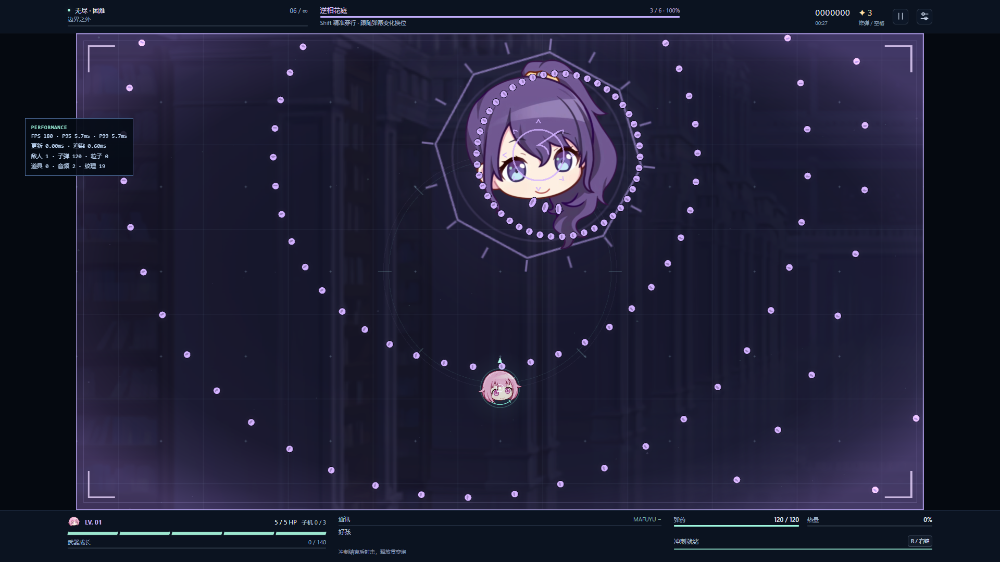
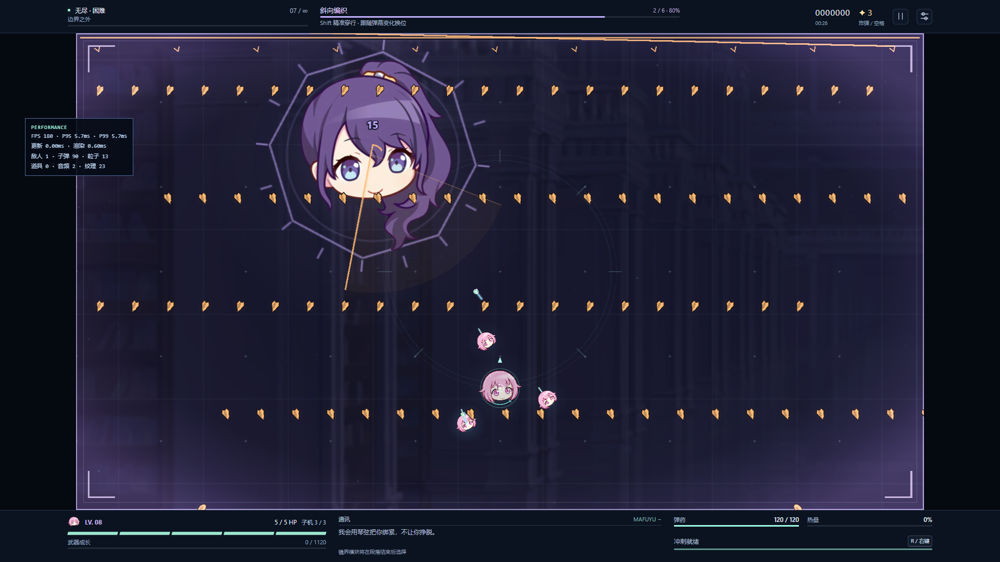

# v4.0.0 验证记录

日期：2026-09-12。设备为 Windows / RTX 3060 Laptop / Chromium 153 / ANGLE D3D11。核显 1080p 60 FPS 仍需对应设备实测。

## 自动化检查

- 类型检查、ESLint、343 项测试通过（17 个测试文件）。包含新战役导演、18 模块、分段弹道、两类玩家判定、真实符卡击破、存档备份修复及运行时销毁。
- 五张原始 PNG 全部与 v2 SHA-256 一致；八份既有额外素材与许可记录一致。
- 生产构建通过。浏览器测试改为构建后的静态预览，避免开发服务器的热更新干扰测试中的游戏。
- 28 项生产浏览器流程测试通过（1.8 分钟）：第一季真实完成事件、保存、刷新、两档第二季入口、七次选择、两位守关首领、六卡终战、无尽、连续 20 次第二季重开、跨标签和存储拒绝。
- WebGL 上下文丢失与素材加载失败为主动注入的恢复测试，均通过；正常流程未出现页面异常。

## 走位与战斗测量

两季 × 两档 × 六卡 × 六起点，共 144 条连续 24 秒路线通过，使用真实模拟、0.2 秒预告反应、正常移速/冲刺冷却、无额外无敌及无炸弹；覆盖四角、近身、常规位置与旧弹叠加。移动窄门另有 180 慢移的完整七轮穿越测试。站桩对照存在实际受击。

普通第一季 Lv7/三子机对照：正常生命 108.717 秒通关，零受伤、零炸弹；额外无敌输出测量 82.117 秒。固定圆周与旧安全方向的 Lv7/Lv10 对照均在前两张卡失败。

第二季低/中/高继承、三种构筑偏好及两档难度的正常生命/无敌输出对照分开记录。模块取自真实七次候选，不注入固定装备；没有把失败的机器人流程说成人工通关。详见 [平衡测量](balance-v4.0.0.md) 与 [原始记录](balance-v4.0.0.json)。无敌测量仅用于完整后段 DPS 与耗时，不证明生存可行性。

36 组矩阵与 4 项控制策略配对均已完成。时长目标尚未覆盖全部配置：普通中继承资源的配对样本总计 779.183 秒、最终战 124.117 秒；普通高继承构筑最终战 87.933–104.032 秒偏短，普通低继承资源配对总计 1076.950 秒、最终战 248.484 秒偏长。低继承配对未使用进攻冲刺，输出分散到小 Boss 增援是主要耗时来源；这些结果既不证明必须选某个模块，也不能作为全构筑真人平衡已通过的结论。首版保留计划卡血量与基础输出，后续试玩需重点校准这两端的节奏。

## 布局与画面

1280×720、1920×1080、2560×1440、2560×1080 均通过菜单、战场比例、HUD 不覆盖画布及低画质预告检查。[逐张视觉检查与截图](v4-visual-review.md)。

## 独立性能测量

1920×1080 窗口，中画质，3 秒预热加 30 秒固定压力：180 非雷敌人、70 地雷、1200 子弹、900 装饰粒子全程维持。

| 指标 | RTX 3060 Laptop |
| --- | ---: |
| 平均 RAF FPS | 179.90 |
| P50 帧间隔 | 5.6 ms |
| P95 / P99 | 5.7 / 5.7 ms |
| 最大单帧间隔 | 22.3 ms |
| 页面错误 | 0 |

上下 HUD 占据窗口的一部分，实际画布为 1628×916；该报告测量的是 1080p 窗口中实际游戏布局，不能误写为 1920×1080 像素的裸画布压测。[原始压力记录](performance-v4.0.0.json)。

另测五个困难密集符卡和七模块连锁场景，每组预热 3 秒、持续 24 秒。初版每组 P95/P99 均约 5.7 ms，资源保持在上限以内；详情见 [逐秒弹幕测量](danmaku-v4.0.0.json)。这些帧间隔结果不能替代输入延迟或核显结论。

## 长时运行与发布

第二季、普通、Lv8/三子机/七模块的 1800 秒真实浏览器无尽运行由 `scripts/soak.mjs` 执行。键鼠事件每 100 ms 驱动，模拟仍为真实时间单循环；无人值守玩家无敌，不用于难度判断。记录堆内存、GC 后保留量、DOM/监听器、实体、纹理与声音数量，并检查回到菜单后停止循环。

完整运行通过：真实时间 1800.039 秒，模拟 1800.017 秒 / 108001 tick，共 61 次资源采样，到达无尽第 40 波。页面/控制台错误均为 0，资源阈值违规为 0。

GC 后保留堆由初始 7.38 MiB 到最终 12.61 MiB；全程采样堆最大 34.29 MiB，后半程保留量稳定在约 12–13 MiB。最终 DOM 监听器 201，初始 208；原始采样超过阈值时的 GC 复核前后数据均保留，没有放宽阈值。重开后只有一个画布与活动 RAF，子机、光束、危险均重置；返回菜单后 RAF 停止，250 ms 后 tick 仍为 0。[完整 1800 秒记录](soak-v4.0.0-s2-normal-1800s.json)、[开局截图](soak-v4.0.0-start.png)、[结束截图](soak-v4.0.0-end.png)。

发布检查使用 `gh api repos/HakureiYoru/mafuyu_sekai/commits/<SHA>/status` 核对该提交的 Vercel 成功状态，再运行 `node scripts/verify-deployment.mjs`。脚本使用全新浏览器测试档，逐张走真实伤害与完成事件路径，验证保存后刷新、第二季困难入口、继承快照和键盘移动；阶段时间和击杀在测试接口中加速，不冒充人工通关。测试档不影响用户浏览器存档，报告及截图保存到 `.tmp/deployment-v4.0.0.json` 和 `.tmp/deployed-v4.0.0.png`。

2026-09-12，功能提交 `4eb8d9047b52bb4a62cd7a8f1d59891e4f596c6a` 已推送 master，[Vercel 部署](https://vercel.com/wenjun-hes-projects/mafuyu-sekai/Dt8zKMBiEKNDxCFs4KtRPXqYVS3L) 返回 success。生产域名 [mafuyu-sekai.vercel.app](https://mafuyu-sekai.vercel.app) 的独立浏览器流程通过：六卡逐一完成、仅写入一次真实完成记录、刷新解锁第二季困难，Lv3 / 40 XP / 三子机完整继承，入场 3 炸弹，选卡时 RAF 停止，按键选择后实际移动超过 50 世界单位，只有一个画布、无页面异常。该低等级来自加速关卡的部署测试夹具，不是战斗平衡样本。[线上测试原始记录](deployment-v4.0.0.json)、[线上第二季截图](deployed-v4.0.0.png)。后续记录提交仅增加这份证据，不修改游戏代码。
